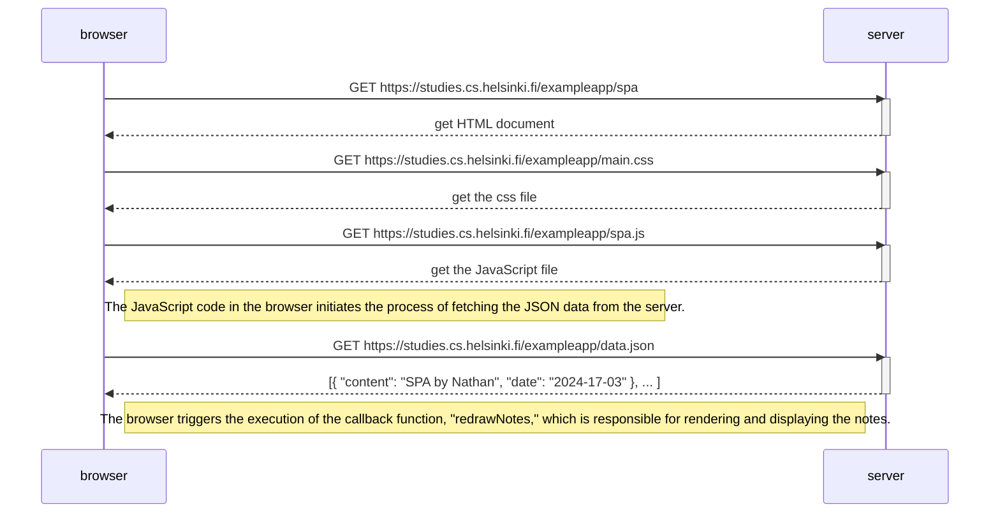

```mermaid
sequenceDiagram
    participant browser
    participant server

    browser->>server: GET https://studies.cs.helsinki.fi/exampleapp/spa
    activate server
    server-->>browser: get HTML document
    deactivate server

    browser->>server: GET https://studies.cs.helsinki.fi/exampleapp/main.css
    activate server
    server-->>browser: get the css file
    deactivate server

    browser->>server: GET https://studies.cs.helsinki.fi/exampleapp/spa.js
    activate server
    server-->>browser: get the JavaScript file
    deactivate server

    Note right of browser: The JavaScript code in the browser initiates the process of fetching the JSON data from the server.

    browser->>server: GET https://studies.cs.helsinki.fi/exampleapp/data.json
    activate server
    server-->>browser: [{ "content": "SPA by Nathan", "date": "2024-17-03" }, ... ]
    deactivate server

    Note right of browser: The browser triggers the execution of the callback function, "redrawNotes," which is responsible for rendering and displaying the notes.


```
